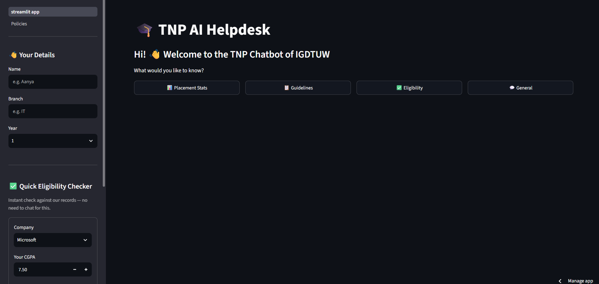
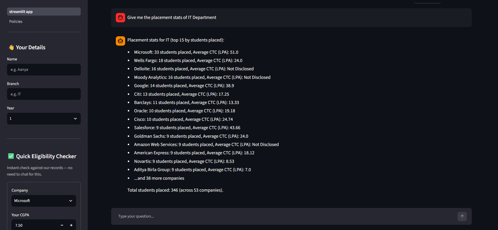
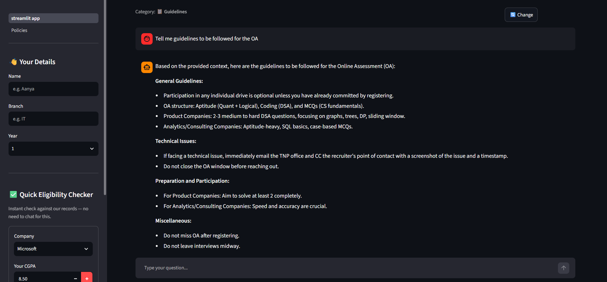
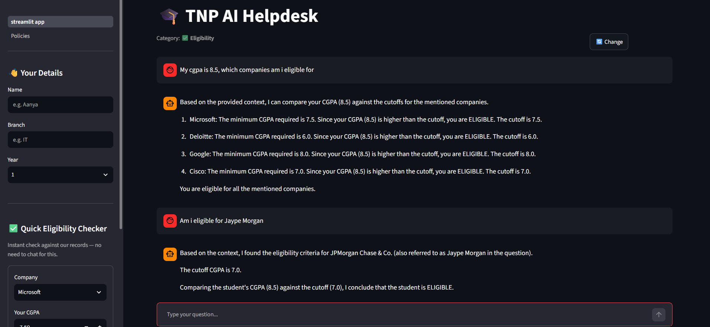
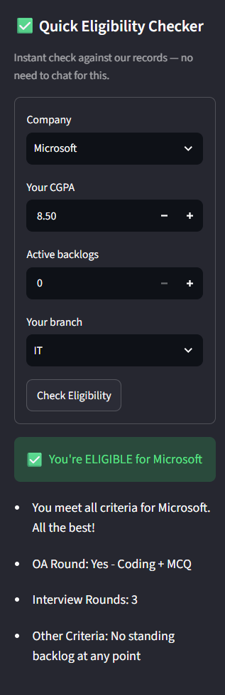
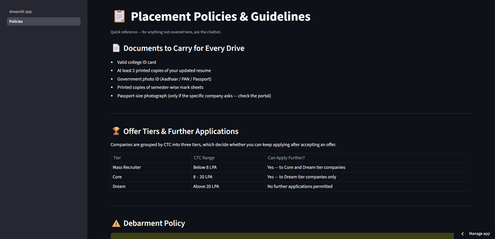

# 🎓 TNP AI Helpdesk

### Intelligent Placement Support System for IGDTUW

---

## 📌 Overview

The **TNP AI Helpdesk** is an intelligent, AI-powered assistant designed to streamline and automate the interaction between students and the **Training & Placement (TnP) Cell**. It leverages **Retrieval-Augmented Generation (RAG)**, **LLMs**, and **Agentic workflows** to provide accurate, context-aware, and real-time responses to placement-related queries.

This system acts as a **24/7 virtual placement assistant**, capable of answering queries related to:

* 📊 Placement statistics
* 🏢 Company-specific guidelines
* ✅ Eligibility criteria
* 💬 General placement queries
* 📈 Analytical insights

---

## 🚀 Key Features

### 🔹 1. Smart Query Handling

* Understands natural language queries
* Routes queries dynamically to relevant modules using **agent-based architecture**

### 🔹 2. Placement Statistics Retrieval

* Fetches and summarizes placement data
* Provides insights like top recruiters, highest packages, etc.

### 🔹 3. Company Guidelines Assistant

* Answers company-specific instructions and recruitment processes

### 🔹 4. Eligibility Checker

* Determines whether a student qualifies for specific companies

### 🔹 5. General Chatbot

* Handles conversational queries using LLMs

### 🔹 6. RAG-based Knowledge System

* Retrieves relevant documents using **FAISS vector store**
* Enhances accuracy by grounding responses in real data

### 🔹 7. Interactive UI

* Built using **Streamlit** for easy accessibility and usability

---

## 🧠 System Architecture

The system is built using a **modular, agent-based architecture** powered by **LangChain + LangGraph**.

### 🏗️ High-Level Flow:

1. User inputs a query via Streamlit UI
2. Query is passed to the **Agent Router**
3. Router determines the intent:

   * Placement stats
   * Guidelines
   * Eligibility
   * General queries
4. Relevant tool/module is triggered
5. If needed, **Retriever (FAISS)** fetches relevant context
6. LLM generates a response using:

   * Retrieved context
   * Prompt templates
   * Chat history
7. Response is displayed to user

---

## ⚙️ Tech Stack

### 💻 Frontend

* **Streamlit**

### 🧠 Backend / AI Layer

* **LangChain**
* **LangGraph**
* **RAG (Retrieval-Augmented Generation)**

### 🤖 Models & APIs

* **Groq LLM** ("llama-3.1-8b-instant")
* **Google Generative AI Embeddings** (`gemini-embedding-001`)

### 📚 Vector Database

* **FAISS (Facebook AI Similarity Search)**

### 🔧 Other Tools

* Python
* Environment variable handling (`os.getenv`)

---


## 🔄 Working Mechanism (Detailed)

### 🧩 Step 1: Query Input

User enters a query like:

> "What is the highest package offered?"

---

### 🧠 Step 2: Intent Classification

The **router agent** determines:

* This is a **placement stats query**

---

### 📚 Step 3: Context Retrieval

* FAISS retrieves relevant documents
* Top-K results (k=4) are selected

---

### 🤖 Step 4: LLM Processing

* Context + query + chat history → passed into prompt template
* LLM generates a **grounded, accurate response**

---

### 📤 Step 5: Output

* Final response shown in Streamlit UI

---

## 🧪 Example Queries

* "Which companies visited this year?"
* "Am I eligible for Google?"
* "What is the highest package?"
* "What are the guidelines for Microsoft?"

---
              User
               │
               ▼
           Streamlit UI
               │
               ▼
    Agent Router (LangGraph)
               │
               ▼
+--------------------------------------------------+
|              Query Type Detection                |
+--------------------------------------------------+
   │        │               │             │
   ▼        ▼               ▼             ▼
Placement  Guidelines  Eligibility  General Chatbot
   │        │               │
   └────────┴───────────────┘
            │
            ▼
     FAISS Retriever
            │
            ▼
   Context Retrieval
            │
            ▼
        LLM Model
            │
            ▼
     Generated Response
            │
            ▼
       Streamlit UI

## 📸 Screenshots

### 🏠 Main Interface  


---

### 📊 Placement Statistics  


---

### 🏢 General Guidelines  


---
### 📈 Detailed Eligibility Page  

---

### ✅ Quick Eligibility Check  


---

### 📜 General Policies Page  


---


## 📊 Advantages

### ✅ 1. Automation of TnP Queries

Reduces manual workload on placement coordinators

### ✅ 2. Real-Time Responses

Instant answers without delays

### ✅ 3. Context-Aware Intelligence

Uses RAG to avoid hallucination and improve accuracy

### ✅ 4. Scalable System

Easily extendable with new datasets and modules

### ✅ 5. User-Friendly Interface

Simple and interactive UI for students

---

## ⚠️ Limitations

* Dependent on quality of dataset
* LLM responses may vary slightly
* Requires API keys for embeddings/LLMs

---

## 🔮 Future Improvements

* 🔹 Add authentication (student login)
* 🔹 Integrate real-time database updates
* 🔹 Improve analytics dashboard
* 🔹 Add voice-based interaction
* 🔹 Deploy on cloud for large-scale usage

---

## 🛠️ Installation & Setup

### 1️⃣ Clone the Repository

```bash
git clone <your-repo-link>
cd TNP-AI-Helpdesk
```

### 2️⃣ Create Virtual Environment

```bash
python -m venv venv
source venv/bin/activate   # Mac/Linux
venv\Scripts\activate      # Windows
```

### 3️⃣ Install Dependencies

```bash
pip install -r requirements.txt
```

### 4️⃣ Set Environment Variables

```bash
export GOOGLE_API_KEY=your_key
export Groq_API_KEY=your_key
```

---

### 5️⃣ Run the Application

```bash
streamlit run streamlit_app.py
```

---


## 📌 Use Case

This system is specifically designed for:

* 🎓 College Placement Cells
* 👩‍🎓 Students seeking placement information
* 📊 Academic analytics and reporting

---

## 📄 Conclusion

The **TNP AI Helpdesk** demonstrates the power of combining **LLMs, RAG, and agent-based workflows** to build intelligent, real-world applications. It significantly enhances the efficiency of placement-related processes and provides a scalable solution for educational institutions.

---

## ⭐ Acknowledgements

* LangChain & LangGraph
* Groq LLM
* Google Generative AI
* FAISS

---

## 📬 Contact

For queries or collaboration, feel free to reach out.

---

⭐ *If you found this project useful, consider giving it a star!*
